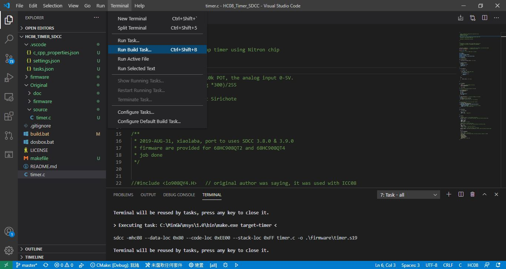

# SDCC_VSCODE_HC08  
VScode, minGW make, SDCC HC08, build enviroment.  
this is working template for the sdcc build with former Motoroal HC08 MCU core (freescal/nxp).    

original project, https://github.com/xiaolaba/HC08_Timer_SDCC   

try and uses VScode to build the same code, SDCC

prerequisition :
SDCC 3.9 used, today perhaps 4.0, https://sourceforge.net/projects/sdcc/files/  
minGW 32, http://sourceforge.net/projects/mingw/files/, uses [make], C:\MinGW\msys\1.0\bin  
Vscode :　https://code.visualstudio.com/download  

job done,  

open vscode,   
  ctrl + shift + p,   
  type "git clone", select,
  input the link of this respository for clone,
  https://github.com/xiaolaba/SDCC_VSCODE_HC08    
  
  select a local folder for the project clone
  accept and open the cloned code 
  
  open the timer.c, ignore any warning unless SDCC / MinGW is not installd  
  [Terminal] / [Run build Task], or press ctrl + shift + b  
  
  timer.s19 will be build at /firmware/  
